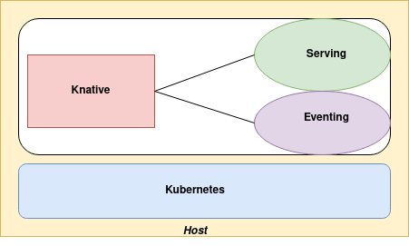
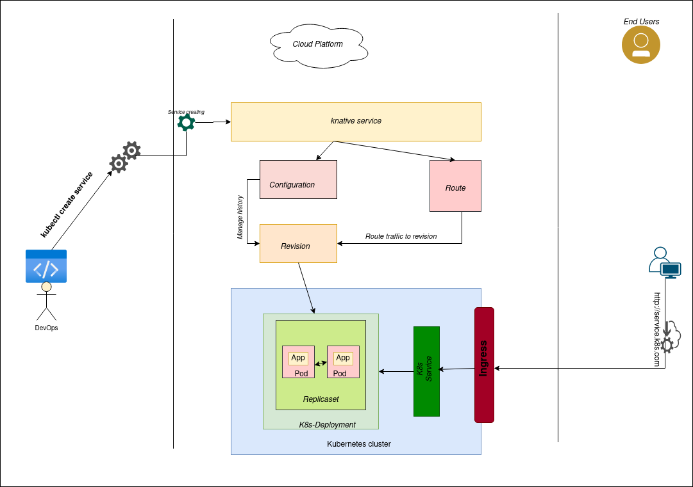
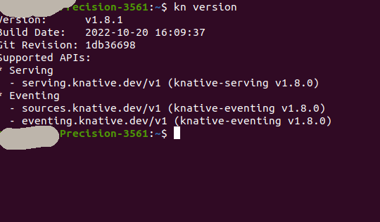
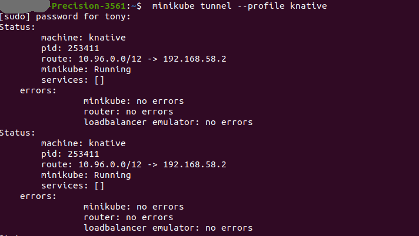
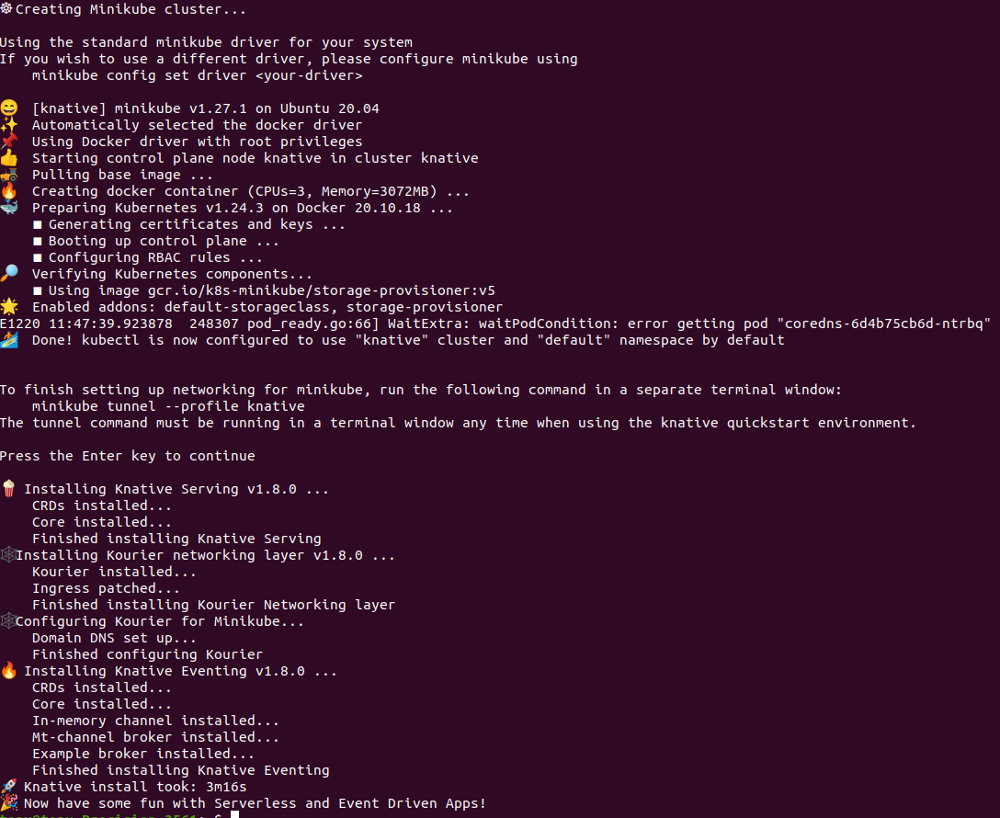
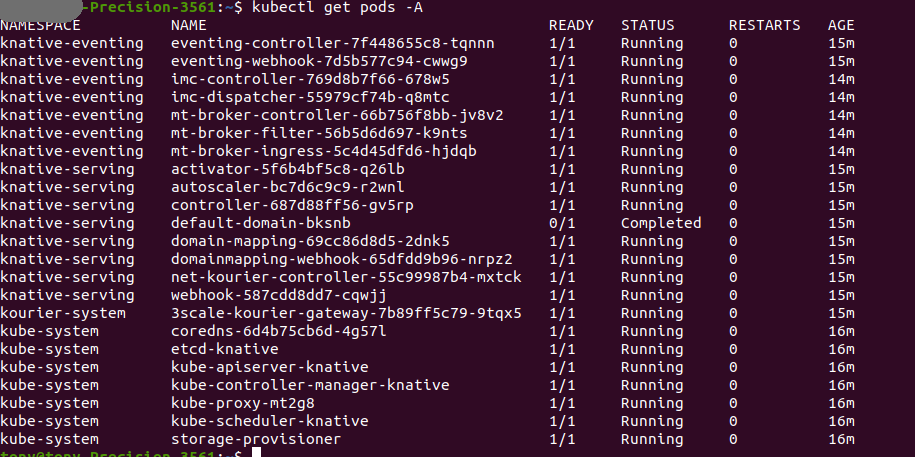

# Faas-tasks: Optimized Resource Management for FaaS platforms

Faas-tasks is a research project whose aim is to explore resource management strategies for modern and upcoming workloads deployed on FaaS (Functions as a Service) platforms.

In particular, we are investigating scheduling strategies for single-function tasks and multi-function tasks (i.e., tasks workflow) with heterogeneous granularities and priorities.

Our ongoing work is based on the [knative](https://knative.dev/) serverless framework.
## Table of contents

#### **1. [General overview](#general-overview)**

#### **2. [Installation](#installation)**
        
#### **3. [Usage](#usage)**

#### **4. [Tests](#tests)**

## General overview

Knative is an Open Source infrastructure for building, deploying and managing serverless applications on kubernetes. 

There are two compoments:



1. **Knative Serving**

   Ideal to running applications services inside kubernetes and the scaling of applications you plan to deploy.

   
   
   The architecture above shows how a service is created and can be summarized as follows:
   
    - The service automatically creates a configuration and a route for the service
    - The configuration manages the revisions
    - Each revision is associated to a Kubernetes deployment

   Above the knative serving architecture. For [more details](https://knative.dev/docs/concepts/) about its components.

2. **Knative Eventing**

   Knative Eventing is a collection of APIs that enable you to use an event-driven architecture with your applications. You can use these APIs to create components that route events from event producers to event consumers, known as sinks, that receive events. Sinks can also be configured to respond to HTTP requests by sending a response event. [Sources](https://knative.dev/docs/eventing/).

Our project will focus on Knative Serving.   

## Installation 

   In this section, we will present the different installation modes of the knative platform. 
   
   1. **Setup a Serverless (Knative) Cluster in single-node**
   
      * Requirements
        - Knative requires a Kubernetes cluster v1.21
        - Hardware support for virtualization and KVM
        - Have docker for vm driver 
        - The Kubernetes CLI to run commands against Kubernetes clusters
        - The Knative CLI kn
        - we use Ubuntu 20.04 LTS
        - You need to have a minimum of 3 CPUs, 10 GB of SSD  and 3 GB of RAM available for the cluster to be created
        
   The following table presents the different hardware and software characteristics used in our work.
       
   |Informations matériels et logiciels| Descriptions |
   |-----------------------------------|--------------| 
   |computer brand                     |Dell-Precision-3561|
   |Ram memory                       | 16 GB|
   |Processor                    | 11th Gen Intel® Core™ i7-11850H @ 2.50GHz × 16|
   |Storage                      | 512,1 GB SSD|
   |OS name       | Ubuntu 20.04.5 LTS|
   |OS type        | 64 bits|

   ###### Step1: Install kubernetes cluster
   For the kubernetes installation, we will use [minikube](https://kubernetes.io/fr/docs/setup/learning-environment/minikube/). Minikube is a tool that makes it easy to run Kubernetes locally.
   
   Download [minikube](https://kubernetes.io/fr/docs/setup/learning-environment/minikube/) and add it to your path: 
   
   ```shell
   curl -LO https://storage.googleapis.com/minikube/releases/latest/minikube-linux-amd64
   sudo install minikube-linux-amd64 /usr/local/bin/minikube
   ```
   
   Download [kubectl](https://kubernetes.io/docs/tasks/tools/install-kubectl-linux/) and add to your path:
   
   ```shell
   curl -LO "https://dl.k8s.io/release/$(curl -L -s https://dl.k8s.io/release/stable.txt)/bin/linux/amd64/kubectl"
   sudo install -o root -g root -m 0755 kubectl /usr/local/bin/kubectl
   ```
   
   To start Minikube and create a cluster, make sure you have [docker](https://docs.docker.com/engine/install/ubuntu/) or [kvm](https://ubuntu.com/blog/kvm-hyphervisor) installed. Read more about [minikube](https://kubernetes.io/fr/docs/setup/learning-environment/minikube/).
   
   ###### **Step2: Knative Install on Minikube**
   Before you start, make sure you have [knative CLI](https://knative.dev/docs/install/quickstart-install/#before-you-begin) installed. Download and install knative CLI:
   
   ```shell
   curl -LO https://github.com/knative/client/releases/download/knative-v1.8.1/kn-linux-amd64
   mv <path-to-binary-file> kn
   chmod +x kn
   mv kn /usr/local/bin
   kn version
   ```
   
   The result is similar to this:

   
   
   To get started, install the Knative `quickstart` plugin:
   
   * Download the binary for your system from the [quickstart release page](https://github.com/knative-sandbox/kn-plugin-quickstart/releases)
   * Rename the file, make the plugin executable and move the executable file to your directory:
   ```shell
   mv kn-quickstart-amd64 kn-quickstart
   chmod +x kn-quickstart
   mv kn-quickstart /usr/local/bin
   ```
   Run knative on minikube by using the command:


   ```shell
   kn quickstart minikube
   ```
   
      The output of the previous command asked you to run minikube tunnel. Run the following command to start the process in a secondary terminal window, then return to the primary window and press enter to continue:
   
   ```shell
   minikube tunnel --profile knative
   ```
   
   
   
   The result is similar to this:

   
   
   Check if all components are started:

   ```
    kubectl get pods -A

   ```
   
   
  2. **Setup a serverless (knative) Cluster in Multi-node**

   To deploy a knative multi-node cluster, follow the steps in the documentation  [knativeMulti-node](knativeCluster-Multi-Node.md)


   


